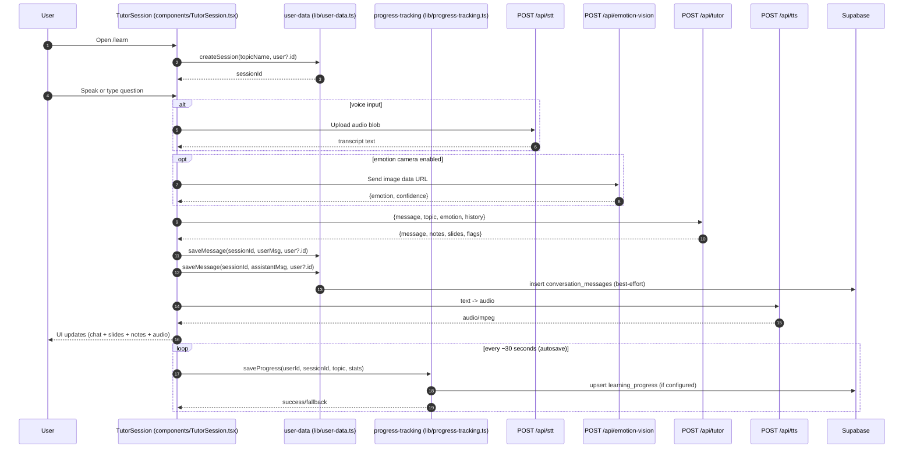
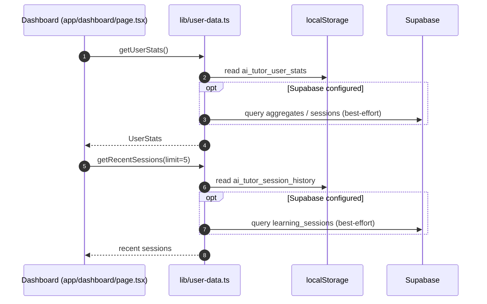
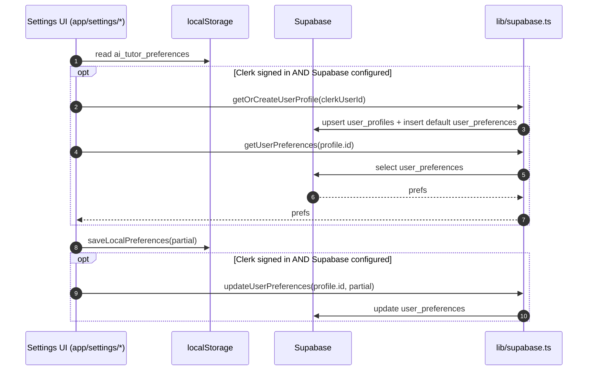

# AI Voice Tutor — Developer Deep Dive (New Dev Onboarding)

This document explains **how the app actually works end‑to‑end**: routing, UI flow, API flow, persistence (localStorage vs Supabase), authentication (Clerk vs demo mode), and where the core logic lives.

It’s written so a new developer can:
- understand the architecture quickly
- trace a user request from UI → API → persistence
- know exactly which file to change for common features/bugs

---

## 1) Tech stack & runtime model

- **Next.js App Router** (`app/`) + React 18
- **TypeScript**
- **TailwindCSS** + some custom utility components under `components/ui/`
- **Framer Motion** animations
- **Clerk** authentication (optional)
- **Supabase** persistence (optional)
- **OpenAI** for:
  - chat tutoring (`/api/tutor`)
  - Whisper STT (`/api/stt`)
  - TTS (`/api/tts`) with optional ElevenLabs
  - emotion vision (`/api/emotion-vision`)
  - diagrams (`/api/diagram`)

The system is designed to run in **three modes**:

- **Demo mode** (no Clerk, no Supabase)
  - app works using **localStorage** for most state
- **Auth-only mode** (Clerk enabled, Supabase not configured)
  - user identity exists, but persistence is still mostly local
- **Full mode** (Clerk + Supabase)
  - sessions, messages, progress, preferences persist in Supabase

---

## 1A) Diagrammatic overview (quick mental picture)

### High-level runtime mode decision

```mermaid
flowchart TD
  A[App starts] --> B{NEXT_PUBLIC_CLERK_PUBLISHABLE_KEY set?}
  B -- No --> C[Demo mode: no ClerkProvider]
  B -- Yes --> D[Clerk mode: app/layout.tsx wraps ClerkProvider]

  C --> E{Supabase configured?\nNEXT_PUBLIC_SUPABASE_URL + ANON_KEY}
  D --> E

  E -- No --> F[localStorage is source of truth\n(best-effort offline)]
  E -- Yes --> G[Supabase enabled\n(upserts + reads)]
```

### High-level architecture (UI + APIs + persistence)

```mermaid
flowchart LR
  subgraph UI[Client UI (Next.js pages/components)]
    L[app/learn/page.tsx\nTutorSession]
    S[app/settings/*]
    H[app/history/*]
    D[app/dashboard/page.tsx]
  end

  subgraph API[Next.js API routes (server)]
    TUTOR[POST /api/tutor]
    STT[POST /api/stt]
    TTS[POST /api/tts]
    EV[POST /api/emotion-vision]
    ET[POST /api/emotion]
    DIAG[POST /api/diagram]
    SLIDES[POST /api/generate-slides]
    PH[GET /api/progress/history]
  end

  subgraph DATA[Persistence]
    LS[(localStorage)]
    SB[(Supabase Postgres)]
  end

  L --> STT
  L --> EV
  L --> ET
  L --> TUTOR
  L --> DIAG
  L --> TTS
  L --> SLIDES

  L --> LS
  L --> SB
  S --> LS
  S --> SB
  H --> PH
  PH --> SB
  D --> LS
  D --> SB
```

Where this is decided:
- `app/layout.tsx` wraps the app in `<ClerkProvider>` only when `NEXT_PUBLIC_CLERK_PUBLISHABLE_KEY` exists.
- `lib/supabase.ts` exports `isSupabaseConfigured` based on `NEXT_PUBLIC_SUPABASE_URL` + `NEXT_PUBLIC_SUPABASE_ANON_KEY`.

---

## 2) Project structure (practical map)

### Top-level routes

- `app/page.tsx`
  - landing page (marketing, pricing, auth CTA)
- `app/dashboard/page.tsx`
  - dashboard stats + recent sessions
- `app/learn/page.tsx`
  - mounts the real tutor experience: `components/TutorSession.tsx`
- `app/settings/page.tsx`
  - settings (demo + Clerk variants)
- `app/history/page.tsx`
  - list past sessions
- `app/history/[sessionId]/page.tsx`
  - show conversation messages for one session

### Core UI component

- `components/TutorSession.tsx`
  - the "orchestrator" of the tutoring experience

### Core business logic

- `lib/user-data.ts`
  - creates/ends sessions, saves messages
  - localStorage is the primary fallback
  - best-effort Supabase writes when configured
- `lib/progress-tracking.ts`
  - save/load/resume/complete progress
  - localStorage fallback; Supabase `upsert` when available
- `lib/useProgressTracking.ts`
  - React hook wrapping `progress-tracking.ts` for UI
- `lib/supabase.ts`
  - Supabase client + health checks + user profile/preferences helpers

---

## 3) Environment variables (what matters)

Template: `.env.example`

### Required for core AI
- `OPENAI_API_KEY`

### Optional providers
- `ELEVENLABS_API_KEY` (optional better voices)

### Authentication
- `NEXT_PUBLIC_CLERK_PUBLISHABLE_KEY`
- `CLERK_SECRET_KEY`

### Persistence
- `NEXT_PUBLIC_SUPABASE_URL`
- `NEXT_PUBLIC_SUPABASE_ANON_KEY`

### App URL
- `NEXT_PUBLIC_APP_URL` (used for links / webhooks if you add them)

---

## 4) Authentication & route protection

File: `middleware.ts`

- If Clerk is configured (`NEXT_PUBLIC_CLERK_PUBLISHABLE_KEY` and `CLERK_SECRET_KEY` exist), the middleware protects **all routes except** the allowlist.
- Public allowlist includes:
  - `/` landing
  - `/sign-in`, `/sign-up`
  - `/learn`, `/dashboard` (currently public)
  - core demo API endpoints (tutor, stt, tts, emotion, diagram, generate-slides)

This means:
- In Clerk mode, `/settings`, `/history` are protected unless added to public routes.

### Route protection diagram (middleware)

```mermaid
flowchart TD
  R[Incoming request] --> M{Clerk configured?\n(NEXT_PUBLIC_CLERK_PUBLISHABLE_KEY + CLERK_SECRET_KEY)}
  M -- No --> N[demoMiddleware()\nallow all routes]
  M -- Yes --> P{Is public route?\ncreateRouteMatcher allowlist}
  P -- Yes --> Q[Allow request]
  P -- No --> Z[auth.protect()\nredirects to sign-in if needed]
```

---

## 5) Data model (Supabase tables you actually touch)

Migration files:
- `migrations/001_create_tables.sql`
- `migrations/002_add_learning_progress.sql`
- `migrations/003_add_user_preferences.sql`

Key tables used by runtime code:

### `user_profiles`
- created/updated via `lib/supabase.ts:getOrCreateUserProfile(clerkUserId, ...)`

### `user_preferences`
- read/write by:
  - `lib/supabase.ts:getUserPreferences(userId)`
  - `lib/supabase.ts:updateUserPreferences(userId, partialPrefs)`
- UI that uses it:
  - `app/settings/page.tsx`
  - `app/settings/audio/page.tsx`

### `learning_sessions`
- created in `lib/user-data.ts:createSession(topicName, clerkUserId?)`
- ended in `lib/user-data.ts:endSession(sessionId)`

### `conversation_messages`
- inserted via `lib/user-data.ts:saveMessage(sessionId, message, clerkUserId?)`
- displayed in `app/history/[sessionId]/page.tsx`

### `learning_progress`
- upserted in `lib/progress-tracking.ts:saveProgress()`
- read in `lib/progress-tracking.ts:getUserLearningHistory()`
- resume logic in `lib/progress-tracking.ts:resumeSession()`

Important: user identity field choice
- Clerk IDs look like `user_...`
- Code often chooses `clerk_user_id` vs `user_id` by checking `userId.startsWith('user_')`

---

## 6) The main user flow (Learn session) — UI → API → persistence

The core learning experience is:

### Primary tutoring loop (sequence diagram)



### Persistence decision (localStorage vs Supabase)

```mermaid
flowchart TD
  A[Need to persist something] --> B{Supabase configured?\nlib/supabase.ts:isSupabaseConfigured}
  B -- No --> C[Write to localStorage only]
  B -- Yes --> D[Write to localStorage first\n(fast + offline)]
  D --> E[Best-effort Supabase write\n(upsert/insert)]
  E --> F{Supabase write succeeded?}
  F -- Yes --> G[Return success: supabase]
  F -- No --> H[Keep localStorage as fallback\nReturn warning]
```

1. User visits `/learn`
   - `app/learn/page.tsx` renders `<TutorSession />`.

2. `TutorSession` boots a session
   - File: `components/TutorSession.tsx`
   - On mount, it calls:
     - `createSession(topicName, user?.id)` from `lib/user-data.ts`
   - `createSession()`:
     - generates a `session_<timestamp>_<random>` id
     - stores a “current session” snapshot in localStorage (`ai_tutor_current_session`)
     - best-effort inserts row into `learning_sessions` if Supabase configured

3. User input (voice or text)
   - **Voice** is captured by `components/SpacebarVoiceInput.tsx` (invoked by TutorSession)
   - The recorded audio is sent to:
     - **STT**: `POST /api/stt` (`app/api/stt/route.ts`)
       - uses OpenAI Whisper `whisper-1`

4. Emotion detection (optional)
   - **Vision-based**: `POST /api/emotion-vision` (`app/api/emotion-vision/route.ts`)
     - uses `gpt-4o-mini` to return JSON `{emotion, confidence}`
     - if OpenAI key missing, returns a neutral fallback
   - **Text-based**: `POST /api/emotion` (`app/api/emotion/route.ts`)
     - uses local heuristic `detectEmotionFromText` from `lib/utils`

5. Tutor response generation
   - `TutorSession` sends the user message to:
     - `POST /api/tutor` (`app/api/tutor/route.ts`)
   - `/api/tutor`:
     - builds a system prompt from `lib/tutor-prompts.ts` and `lib/adaptive-response.ts`
     - includes a short `history` array (previous chat turns)
     - calls OpenAI `gpt-4o`
     - returns:
       - `message` (assistant content)
       - `notes` (extracted key points)
       - `slides` (generated learning slides)
       - flags like `needsQuiz`, `needsDiagram`, `needsSimplification`, etc.

6. TutorSession renders content
   - Chat messages
   - Notes via `components/NotesPanel.tsx`
   - Slides via `components/LearningSlidePanel.tsx`
   - Diagrams via `components/MermaidDiagram.tsx`

7. Persistence during the session

### Messages
- `TutorSession` calls `saveMessage(sessionId, message, user?.id)` (`lib/user-data.ts`)
- This inserts into Supabase table `conversation_messages` when configured.

### Progress
- `TutorSession` uses `useProgressTracking(user?.id)`
  - `lib/useProgressTracking.ts` wraps `lib/progress-tracking.ts`
- Every ~30 seconds, TutorSession auto-saves:
  - progress % based on slide index
  - stats like `questionsAsked`, `timeSpent`, etc.
- Save path:
  - `useProgressTracking.saveCurrentProgress()` → `saveProgress()`
  - `saveProgress()`:
    - writes fallback to localStorage key `learning_progress_<sessionId>`
    - then `upsert` into Supabase `learning_progress` if configured

8. Ending a session
- In TutorSession `handleEndSession()`:
  - saves final progress
  - calls `progressTracking.completeCurrentSession()` → `completeSession()`
  - calls `endSession(sessionId)` from `lib/user-data.ts`
  - navigates to `/dashboard`

---

## 7) Dashboard flow

Route: `app/dashboard/page.tsx`

Dashboard loads:
- `getUserStats()` from `lib/user-data.ts`
- `getRecentSessions(undefined, 5)` from `lib/user-data.ts`

These functions typically:
- read localStorage first
- then use Supabase when configured

Note: Dashboard currently uses a window-based Clerk polling helper to get user info; Settings uses `useUser()`. If you want consistency, refactor dashboard similarly.

### Dashboard data load diagram



---

## 8) History (Past Sessions) flow

### List
- Route: `app/history/page.tsx`

Two modes:
- Clerk mode:
  - `GET /api/progress/history?userId=...` (`app/api/progress/history/route.ts`)
  - reads from Supabase `learning_progress`
- Demo mode:
  - reads localStorage `ai_tutor_session_history` and maps it to list items

### Detail
- Route: `app/history/[sessionId]/page.tsx`
- Loads from Supabase:
  - `conversation_messages` filtered by `session_id`

If Supabase not configured, detail page displays a message explaining it.

### History list + detail diagram

```mermaid
flowchart TD
  A[User opens /history] --> B{Clerk configured?}
  B -- No --> C[Demo: read ai_tutor_session_history from localStorage]
  B -- Yes --> D[Fetch GET /api/progress/history?userId=...]
  D --> E[Supabase: select learning_progress\norder by last_accessed_at]
  C --> F[Render list]
  E --> F
  F --> G[User clicks session]
  G --> H[/history/[sessionId]]
  H --> I{Supabase configured?}
  I -- No --> J[Show info: Supabase required]
  I -- Yes --> K[Supabase: select conversation_messages by session_id]
  K --> L[Render conversation]
```

---

## 9) Settings flow (Preferences & Audio)

### Settings
- Route: `app/settings/page.tsx`

Two modes:
- demo mode: localStorage only
- Clerk mode:
  - localStorage always updated
  - if Supabase configured + signed in:
    - `getOrCreateUserProfile(user.id)`
    - `getUserPreferences(profile.id)`
    - `updateUserPreferences(profile.id, ...)` on toggles

### Audio Settings
- Route: `app/settings/audio/page.tsx`
- Persisted fields:
  - `preferred_voice`
  - `voice_speed`

### Settings persistence diagram



---

## 10) API endpoints (what exists today)

All API routes are under `app/api/*/route.ts`:

- `POST /api/tutor` — `app/api/tutor/route.ts`
- `POST /api/stt` — `app/api/stt/route.ts`
- `POST /api/tts` — `app/api/tts/route.ts`
- `POST /api/emotion` — `app/api/emotion/route.ts`
- `POST /api/emotion-vision` — `app/api/emotion-vision/route.ts`
- `POST /api/generate-slides` — `app/api/generate-slides/route.ts`
- `POST /api/diagram` — `app/api/diagram/route.ts`
- `POST /api/email-notes` — `app/api/email-notes/route.ts` (logs HTML; no real email service wired)

Progress APIs:
- `POST /api/progress/save` — `app/api/progress/save/route.ts`
- `GET /api/progress/resume` — `app/api/progress/resume/route.ts`
- `POST /api/progress/complete` — `app/api/progress/complete/route.ts`
- `GET /api/progress/history` — `app/api/progress/history/route.ts`

Important: progress persistence exists in **two places**:
- client-side via `lib/progress-tracking.ts`
- server routes under `app/api/progress/*`

Today, `TutorSession` primarily uses the **client lib**, not the API routes.

---

## 11) Mermaid diagrams (why we sanitize)

Diagram generation:
- `POST /api/diagram` → `app/api/diagram/route.ts`

It uses helper functions from `lib/utils`:
- `sanitizeMermaidCode()`
- `validateMermaidCode()`

Hardening choices made in the API:
- Remove markdown wrappers
- Sanitize illegal characters
- Explicitly remove `|` inside decision node text (`{...}`)

This prevents runtime errors when `MermaidDiagram` tries to render invalid Mermaid syntax.

---

## 12) Common debugging playbook (realistic)

### A) “Supabase not saving anything”
Check:
- `.env.local` has correct `NEXT_PUBLIC_SUPABASE_URL` and `NEXT_PUBLIC_SUPABASE_ANON_KEY`
- Browser console prints `[Supabase] Configuration Status` (from `lib/supabase.ts`)
- Run migrations:
  - `migrations/001_create_tables.sql`
  - `migrations/002_add_learning_progress.sql`
  - `migrations/003_add_user_preferences.sql`

### B) “History shows empty even after sessions”
Ensure:
- `saveProgress()` is being called (TutorSession auto-saves every 30s)
- session completion calls `completeSession()`
- `learning_progress` rows exist in Supabase with matching `clerk_user_id`

### C) “Session detail page shows no messages”
Check:
- `saveMessage()` is called for both user+assistant turns
- `conversation_messages` table exists and has rows for that `session_id`

### D) “OpenAI errors / quota / key missing”
- `/api/tutor`, `/api/stt`, `/api/tts`, `/api/generate-slides`, `/api/emotion-vision`, `/api/diagram` all depend on `OPENAI_API_KEY`.
- Most endpoints return `{ code: 'API_KEY_MISSING' }` or neutral fallbacks.

### E) “Clerk crashes when env missing”
- Ensure components don’t call `useUser()` unless `ClerkProvider` exists.
  - Pattern used: split Demo vs Clerk component (as in `app/settings/page.tsx`).

---

## 13) Where to implement new features safely

### Subscription / Billing
- Today: `app/settings/billing/page.tsx` is a placeholder.
- You already have `subscription_tier` and `subscription_status` fields in the `UserProfile` type (see `lib/supabase.ts`).
- Expected future flow:
  - Clerk Billing → webhook → update `user_profiles.subscription_*`
  - gate premium topics / features based on that.

### Export session data
- You already have the raw messages in `conversation_messages`.
- Add endpoints like:
  - `GET /api/history/export?sessionId=...`
  - or client-side export from `app/history/[sessionId]/page.tsx`

### Replace localStorage fallbacks
- Central keys live in `lib/user-data.ts` (`STORAGE_KEYS`)
- Progress keys live in `lib/progress-tracking.ts`

---

## 14) Quick mental model (TL;DR)

- `/learn` mounts `TutorSession`
- `TutorSession` drives everything
  - voice → `/api/stt`
  - emotion → `/api/emotion-vision` (optional)
  - tutoring → `/api/tutor`
  - diagrams → `/api/diagram`
  - persist messages → `lib/user-data.ts:saveMessage`
  - persist progress → `lib/progress-tracking.ts:saveProgress`
- `/dashboard` summarizes sessions
- `/history` is mostly `learning_progress`
- `/history/[sessionId]` is `conversation_messages`
- `/settings` is localStorage + (Supabase user_preferences if enabled)

---

## 15) Next improvements (recommended)

- **Unify user identity retrieval** on Dashboard (move from window polling to `useUser()` with demo fallback like Settings).
- **Consolidate progress persistence**: pick either client-lib only or API routes only (today both exist).
- **Billing integration**: implement Clerk Billing + webhook and update `user_profiles.subscription_*`.
- Add **tests** for:
  - Mermaid sanitization
  - progress upsert payload shape
  - session id handling

---

If you want, I can follow up by:
- adding diagrams to this doc (sequence diagrams / data flow)
- writing a “new feature checklist” (where to touch UI, API, DB)
- documenting each Supabase table with columns and relations in one place
