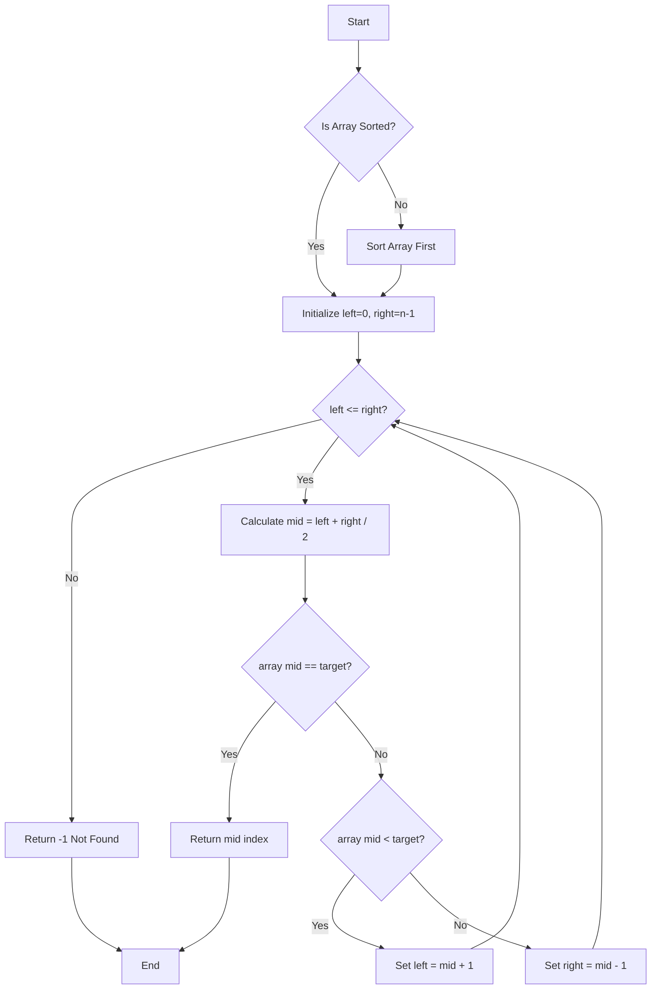
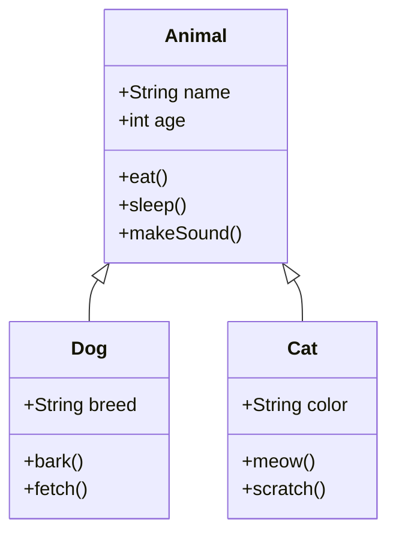
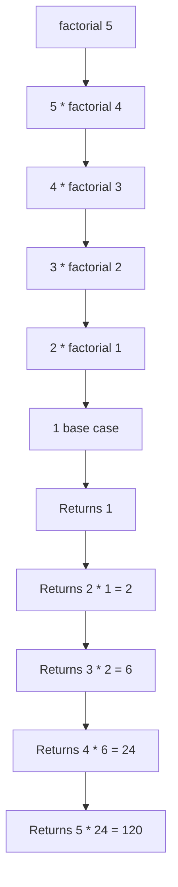
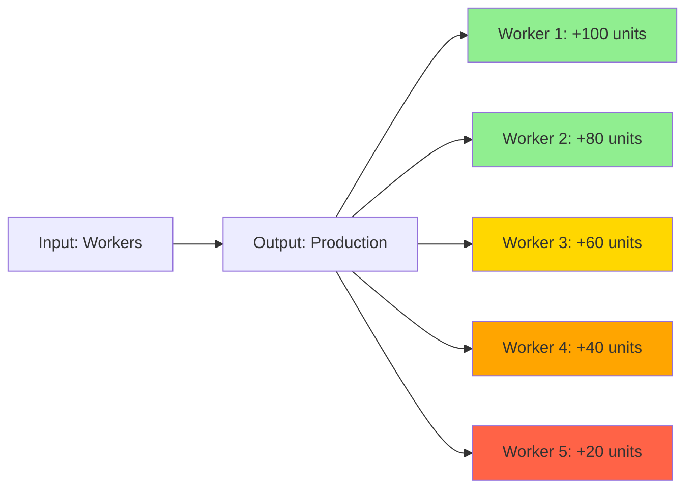
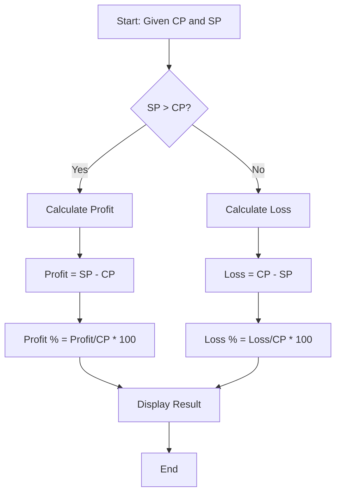
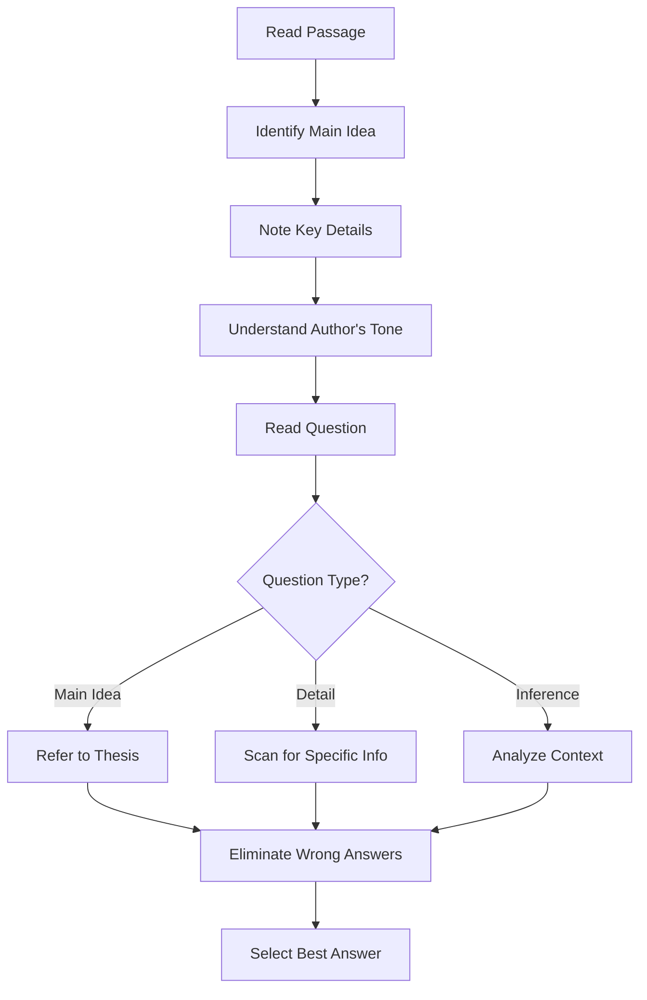

# 📊 Mermaid Diagram Integration Guide

## Overview

This project uses **Mermaid.js v10.9.1** for generating educational diagrams. This document explains the implementation, fixes for common syntax issues, and provides working examples.

## Mermaid Version & Compatibility

- **Version Used**: 10.9.1 (stable)
- **Breaking Changes Fixed**: Updated from v11 syntax to v10 compatible syntax
- **Browser Support**: All modern browsers (Chrome, Firefox, Safari, Edge)

## Implementation Details

### Component: `components/MermaidDiagram.tsx`

```typescript
import { useEffect, useRef } from 'react';
import mermaid from 'mermaid';

export default function MermaidDiagram({ code }: { code: string }) {
  const containerRef = useRef<HTMLDivElement>(null);

  useEffect(() => {
    // Initialize with v10 compatible config
    mermaid.initialize({
      startOnLoad: false,
      theme: 'default',
      securityLevel: 'loose',
      fontFamily: 'Arial, sans-serif',
    });

    const renderDiagram = async () => {
      if (containerRef.current && code) {
        try {
          const id = `mermaid-${Math.random().toString(36).substr(2, 9)}`;
          const { svg } = await mermaid.render(id, code);
          containerRef.current.innerHTML = svg;
        } catch (error) {
          // Error handling with fallback UI
          containerRef.current.innerHTML = `<div class="error">...</div>`;
        }
      }
    };

    renderDiagram();
  }, [code]);

  return <div ref={containerRef} />;
}
```

### Key Fixes Applied

#### 1. **Removed Version 11 Syntax**
   - ❌ Old: `%%{init: {'theme':'base'}}%%`
   - ✅ New: Configure via `mermaid.initialize()`

#### 2. **Simplified Styling**
   - ❌ Old: Custom `classDef` and `style` definitions
   - ✅ New: Use default theme, avoid custom styling

#### 3. **Fixed Graph Syntax**
   - ❌ Old: `graph LR` with complex node IDs
   - ✅ New: `graph TD` or `flowchart TD` with simple IDs

#### 4. **Updated Class Diagrams**
   - ❌ Old: Complex method signatures
   - ✅ New: Simple method names without types

## Working Examples

### 1. Binary Search Flowchart

**Topic**: Data Structures & Algorithms - Binary Search



**Usage in AI Tutor**:
When a student asks "How does binary search work?", the tutor can generate this diagram to visualize the algorithm flow.

### 2. OOP Class Hierarchy

**Topic**: Object-Oriented Programming



**Usage in AI Tutor**:
When explaining inheritance and polymorphism, this diagram shows the relationship between parent and child classes.

### 3. Recursion Concept

**Topic**: Recursion in Programming



**Usage in AI Tutor**:
Visualizes how recursive calls work with a factorial example.

### 4. Economic Concept - Diminishing Returns

**Topic**: Economics - Law of Diminishing Returns



**Usage in AI Tutor**:
Shows how additional inputs (workers) yield decreasing marginal output.

### 5. Problem-Solving Flowchart

**Topic**: Aptitude - Profit & Loss Calculation



**Usage in AI Tutor**:
Step-by-step visualization of profit/loss calculation process.

### 6. GRE Verbal - Reading Strategy

**Topic**: GRE Verbal Reasoning



**Usage in AI Tutor**:
Strategy guide for tackling GRE reading comprehension questions.

## API Integration

### Diagram Generation API: `/api/diagram`

```typescript
// Request
POST /api/diagram
{
  "topic": "Binary Search",
  "description": "Show the step-by-step process",
  "type": "mermaid"
}

// Response
{
  "success": true,
  "mermaid": "flowchart TD\n    A[Start]...",
  "imageUrl": null
}
```

### GPT-4 Prompt for Diagram Generation

```typescript
const prompt = `Generate a Mermaid diagram for: "${topic}"

Requirements:
- Use Mermaid version 10.x syntax
- Keep it simple and educational
- Use flowchart, class diagram, or graph as appropriate
- Avoid complex styling
- Make it clear for students

Return ONLY the Mermaid code, no explanations.`;
```

## Common Issues & Solutions

### Issue 1: Diagram Not Rendering

**Symptoms**: Blank space or error message

**Solutions**:
1. Check browser console for Mermaid syntax errors
2. Verify code doesn't use v11-only features
3. Ensure no special characters in node IDs
4. Test diagram in [Mermaid Live Editor](https://mermaid.live)

### Issue 2: Syntax Errors from GPT-4

**Symptoms**: GPT generates invalid Mermaid code

**Solutions**:
1. Update system prompt with v10 syntax examples
2. Add validation layer before rendering
3. Implement fallback to image generation (DALL-E)

### Issue 3: Styling Not Applied

**Symptoms**: Diagrams look plain

**Solutions**:
1. Use Mermaid's built-in themes: `default`, `forest`, `dark`, `neutral`
2. Apply CSS to the container div instead
3. Keep styling minimal for educational clarity

## Fallback Mechanism

When Mermaid rendering fails, the system automatically:

1. **Display Error Message**: Shows user-friendly error
2. **Fallback to DALL-E 3**: Generates diagram as image
3. **Show Code**: Allows debugging via collapsible code view

```typescript
// In MermaidDiagram component
catch (error) {
  // Show error UI with code preview
  containerRef.current.innerHTML = `
    <div class="error-container">
      <p>Failed to render diagram</p>
      <details>
        <summary>Show code</summary>
        <pre>${code}</pre>
      </details>
    </div>
  `;
}
```

## Testing Diagrams

### Manual Testing

1. Go to [Mermaid Live Editor](https://mermaid.live)
2. Paste generated code
3. Verify rendering
4. Copy working code to app

### Automated Testing (Optional)

```typescript
// Jest test example
import mermaid from 'mermaid';

test('Binary Search diagram renders', async () => {
  const code = `flowchart TD\n    A[Start] --> B[End]`;
  const { svg } = await mermaid.render('test-id', code);
  expect(svg).toContain('<svg');
});
```

## Best Practices

1. **Keep Diagrams Simple**: Max 10-15 nodes for clarity
2. **Use Descriptive Labels**: Clear, concise node text
3. **Limit Connections**: Avoid spaghetti diagrams
4. **Choose Right Type**: 
   - Flowchart for processes
   - Class diagram for OOP
   - Graph for relationships
5. **Test Before Deploy**: Always verify in live editor

## Future Enhancements

- [ ] Add more diagram types (sequence, state, Gantt)
- [ ] Implement diagram caching
- [ ] Add diagram download feature
- [ ] Support custom themes
- [ ] Interactive diagrams (click to expand)
- [ ] Diagram history/versioning

## Resources

- [Mermaid Official Docs](https://mermaid.js.org/)
- [Mermaid Live Editor](https://mermaid.live)
- [Mermaid GitHub](https://github.com/mermaid-js/mermaid)
- [Syntax Reference](https://mermaid.js.org/intro/syntax-reference.html)

---

**Note**: All diagrams in this project use Mermaid v10.9.1 compatible syntax. If upgrading Mermaid, test all diagram generation prompts.
