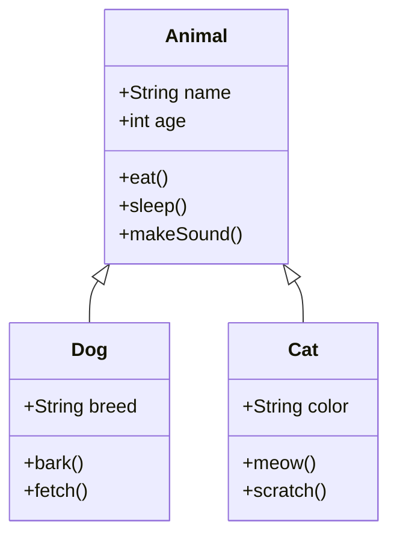

# 🎓 AI Voice Tutor - Interactive Learning Platform

> **⚠️ IMPORTANT:** Application is fully functional but requires OpenAI credits.  
> **Status:** ✅ Build successful | ⚠️ Add API credits to test  
> **See:** [API_SETUP.md](API_SETUP.md) and [STATUS_SUMMARY.md](STATUS_SUMMARY.md)

A production-ready AI-powered voice tutoring web application that provides adaptive, emotion-aware teaching for students. Built with Next.js, OpenAI GPT-4, Whisper STT, and OpenAI TTS.

## 🚀 Quick Start

```bash
# 1. Install dependencies
npm install

# 2. Add your OpenAI API key with credits to .env
OPENAI_API_KEY=sk-your-key-here

# 3. Run development server
npm run dev

# 4. Open http://localhost:3000
```

**Need help?** See [QUICKSTART.md](QUICKSTART.md) or [API_SETUP.md](API_SETUP.md)

## ✨ Features

### 🎙️ Voice-First Learning
- **Real-time Voice Recording**: Click-to-record microphone interface
- **Speech-to-Text (STT)**: Powered by OpenAI Whisper for accurate transcription
- **Text-to-Speech (TTS)**: Natural voice responses using OpenAI TTS or ElevenLabs
- **Full Voice Loop**: Speak → Transcribe → AI Response → Voice Reply

### 😊 Emotion Detection & Adaptive Teaching
- **Real-time Emotion Detection**: Analyzes text/voice for emotional state
- **7 Emotion States**: Neutral, Confused, Confident, Frustrated, Bored, Excited, Curious
- **Adaptive Responses**: Teaching style adjusts based on detected emotion
  - Confused → Simpler explanations with more examples
  - Confident → More challenging concepts
  - Frustrated → Encouragement and alternative approaches
  - Bored → More engaging content and fun facts

### 🧠 Smart AI Tutor
- **Context-Aware**: Maintains conversation history
- **Step-by-Step Teaching**: Breaks down complex topics
- **Follow-up Questions**: Checks understanding
- **Visual Learning**: Auto-generates diagrams and visuals
- **Key Notes Extraction**: Highlights important concepts

### 📚 Pre-loaded Learning Topics
- **Economics**: Law of Diminishing Returns
- **Data Structures & Algorithms**: Binary Search, Recursion
- **Aptitude**: Percentages, Profit & Loss
- **GRE Prep**: Quantitative Reasoning, Verbal Reasoning
- **Programming**: Object-Oriented Programming Basics

### 📊 Visual Diagrams
- **Mermaid Integration**: Auto-generated flowcharts, class diagrams
- **Fallback to DALL-E**: Image generation when diagrams needed
- **Version 10.x Compatible**: Fixed Mermaid syntax issues

## 🛠️ Tech Stack

### Frontend
- **Next.js 14** (App Router)
- **React 18**
- **TypeScript**
- **Tailwind CSS**
- **Lucide Icons**

### Backend
- **Next.js API Routes**
- **OpenAI GPT-4o** (LLM)
- **OpenAI Whisper** (STT)
- **OpenAI TTS / ElevenLabs** (Text-to-Speech)
- **OpenAI DALL-E 3** (Diagram fallback)

### Database (Optional)
- **Supabase** (PostgreSQL)
- Can store sessions, conversation history, user progress

### Visualization
- **Mermaid.js** (v10.9.1 - Compatible syntax)

## 📁 Project Structure

```
ai-voice-tutor/
├── app/
│   ├── api/
│   │   ├── stt/route.ts          # Speech-to-Text endpoint
│   │   ├── tutor/route.ts        # AI Tutor chat endpoint
│   │   ├── tts/route.ts          # Text-to-Speech endpoint
│   │   ├── emotion/route.ts      # Emotion detection endpoint
│   │   └── diagram/route.ts      # Diagram generation endpoint
│   ├── globals.css               # Global styles & animations
│   ├── layout.tsx                # Root layout
│   └── page.tsx                  # Main app page
├── components/
│   ├── VoiceRecorder.tsx         # Voice recording UI
│   ├── ChatMessage.tsx           # Message bubble component
│   ├── EmotionBadge.tsx          # Emotion display badge
│   ├── TopicSelector.tsx         # Topic selection dropdown
│   ├── NotesDisplay.tsx          # Key points display
│   └── MermaidDiagram.tsx        # Diagram renderer
├── lib/
│   ├── supabase.ts               # Supabase client & types
│   ├── utils.ts                  # Utility functions & emotion logic
│   └── tutor-prompts.ts          # AI system prompts & topics
├── .env.example                  # Environment variables template
├── package.json                  # Dependencies
├── tsconfig.json                 # TypeScript config
├── tailwind.config.ts            # Tailwind config
├── next.config.js                # Next.js config
└── README.md                     # This file
```

## 🚀 Quick Start

### Prerequisites
- Node.js 18+ installed
- OpenAI API key (required)
- Optional: Deepgram, ElevenLabs, Supabase keys

### 1. Clone & Install

```bash
cd ai-voice-tutor
npm install
```

### 2. Setup Environment Variables

Copy `.env.example` to `.env`:

```bash
cp .env.example .env
```

Edit `.env` and add your API keys:

```env
# Required
OPENAI_API_KEY=sk-your-openai-api-key-here

# Optional (for better STT)
DEEPGRAM_API_KEY=your-deepgram-key-here

# Optional (for better TTS)
ELEVENLABS_API_KEY=your-elevenlabs-key-here

# Optional (for session storage)
NEXT_PUBLIC_SUPABASE_URL=https://your-project.supabase.co
NEXT_PUBLIC_SUPABASE_ANON_KEY=your-supabase-anon-key-here

# App URL
NEXT_PUBLIC_APP_URL=http://localhost:3000
```

### 3. Run Development Server

```bash
npm run dev
```

Open [http://localhost:3000](http://localhost:3000) in your browser.

### 4. Production Build

```bash
npm run build
npm start
```

## 🎯 How to Use

1. **Select a Topic**: Choose from Economics, DSA, Aptitude, GRE, or Programming
2. **Ask Questions**: 
   - Type in the chat box, OR
   - Click the microphone button to speak
3. **Get Adaptive Responses**: 
   - AI tutor adapts to your emotion
   - Provides step-by-step explanations
   - Generates diagrams when helpful
4. **Review Notes**: Key points appear in the sidebar
5. **Listen to Responses**: Voice replies play automatically

## 🔑 API Keys Setup

### OpenAI (Required)
1. Go to [platform.openai.com](https://platform.openai.com)
2. Create account and navigate to API Keys
3. Generate new secret key
4. Add to `.env` as `OPENAI_API_KEY`

### ElevenLabs (Optional - Better TTS)
1. Go to [elevenlabs.io](https://elevenlabs.io)
2. Sign up and go to Profile → API Key
3. Copy key to `.env` as `ELEVENLABS_API_KEY`

### Deepgram (Optional - Better STT)
1. Go to [deepgram.com](https://deepgram.com)
2. Create account and get API key
3. Add to `.env` as `DEEPGRAM_API_KEY`

### Supabase (Optional - Session Storage)
1. Go to [supabase.com](https://supabase.com)
2. Create new project
3. Copy URL and anon key from Settings → API
4. Add to `.env` as shown above

## 📊 Mermaid Diagram Examples

### Binary Search Flowchart
```mermaid
graph TD
    A[Start] --> B{Array Sorted?}
    B -->|Yes| C[Set left=0, right=n-1]
    B -->|No| D[Sort Array First]
    D --> C
    C --> E{left <= right?}
    E -->|No| F[Return Not Found]
    E -->|Yes| G[mid = left + right / 2]
    G --> H{arr[mid] == target?}
    H -->|Yes| I[Return mid]
    H -->|No| J{arr[mid] < target?}
    J -->|Yes| K[left = mid + 1]
    J -->|No| L[right = mid - 1]
    K --> E
    L --> E
```

### OOP Class Diagram


## 🧠 AI System Prompt

The tutor uses a sophisticated system prompt that:
- Adapts to student emotions (confused, confident, frustrated, etc.)
- Provides age-appropriate explanations for teens
- Uses real-world examples and analogies
- Checks understanding with follow-up questions
- Suggests diagrams and quizzes when appropriate

Example prompt structure:
```
You are a helpful, patient AI tutor for teenagers.
Current topic: Binary Search
Student emotion: Confused

Teaching guidance:
- Slow down and use simpler language
- Provide more examples
- Break concepts into smaller pieces
- Ask if clarification is needed
```

## 🎨 Emotion Detection Logic

### Text-based Keyword Detection
```typescript
const emotionKeywords = {
  confused: ['confused', 'don\'t understand', 'unclear', 'lost'],
  confident: ['got it', 'i understand', 'makes sense', 'clear'],
  frustrated: ['frustrated', 'difficult', 'hard', 'stuck'],
  // ... more emotions
}
```

### Visual Feedback
- **Badge Color**: Each emotion has unique color (yellow=confused, green=confident, etc.)
- **Emoji**: Visual representation (😕, 😊, 😤, etc.)
- **Adaptive UI**: Changes tutor behavior in real-time

## 🐛 Troubleshooting

### Microphone Not Working
- Check browser permissions (allow microphone access)
- Use HTTPS in production (required for mic access)
- Try different browser (Chrome/Edge recommended)

### Mermaid Diagrams Not Rendering
- Check browser console for syntax errors
- Ensure using Mermaid 10.x compatible syntax
- Fallback to image generation available

### OpenAI API Errors
- Verify API key is correct
- Check account has credits
- Ensure model `gpt-4o` is accessible

### Audio Playback Issues
- Check browser audio permissions
- Ensure speakers/headphones connected
- Try different audio output device

## 📦 Dependencies

### Core
- `next`: 14.2.3
- `react`: 18.3.1
- `typescript`: 5.4.5

### AI/ML
- `openai`: 4.47.1

### UI/UX
- `tailwindcss`: 3.4.3
- `lucide-react`: 0.379.0
- `mermaid`: 10.9.1

### Utilities
- `@supabase/supabase-js`: 2.43.4
- `axios`: 1.7.2
- `clsx` + `tailwind-merge`

## 🚀 Deployment

### Vercel (Recommended)
1. Push code to GitHub
2. Import project in Vercel
3. Add environment variables
4. Deploy

### Docker
```dockerfile
FROM node:18-alpine
WORKDIR /app
COPY package*.json ./
RUN npm install
COPY . .
RUN npm run build
EXPOSE 3000
CMD ["npm", "start"]
```

## 📝 License

MIT License - feel free to use for learning and projects.

## 🙏 Credits

Built with:
- OpenAI GPT-4, Whisper, TTS
- Next.js & React
- Mermaid.js
- Tailwind CSS

## 💡 Future Enhancements

- [ ] User authentication
- [ ] Progress tracking & analytics
- [ ] Quiz generation & scoring
- [ ] Multi-language support
- [ ] Mobile app (React Native)
- [ ] Advanced audio emotion detection
- [ ] Collaborative learning sessions
- [ ] Custom topic creation

## 🆘 Support

For issues or questions:
1. Check this README
2. Review code comments
3. Check browser console for errors
4. Verify all API keys are set correctly

---

**Ready to learn? Just run `npm install && npm run dev` and start asking questions!** 🎓
